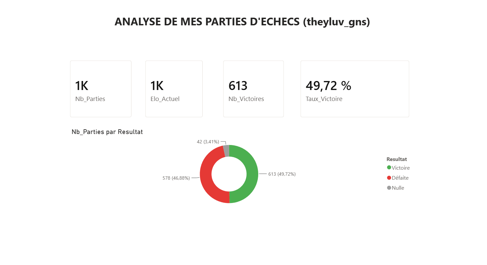
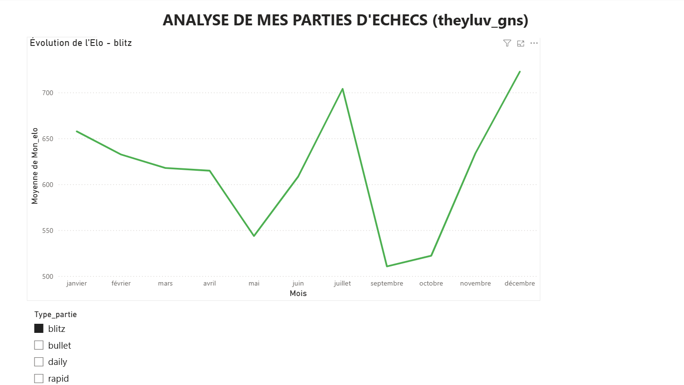

# ♟️ Chess.com Analytics Dashboard


Analyse de mes parties d'échecs jouées sur **Chess.com** : extraction via l'API officielle, nettoyage des données brutes, et dashboard interactif Power BI pour explorer ma progression, mes ouvertures préférées et mes habitudes de jeu.

Projet réalisé pour m'entraîner sur un pipeline complet de data : **extraction API → nettoyage → dashboard BI**, sur mes propres données réelles.

> 🎓 Projet personnel réalisé dans le cadre de ma recherche d'alternance en data.

## 🎯 Objectifs

- Extraire l'historique complet de mes parties via l'API publique Chess.com
- Construire un pipeline de nettoyage pour transformer des données JSON brutes en dataset exploitable
- Explorer ma progression d'Elo dans le temps, par type de partie (blitz/bullet/rapid)
- Identifier mes ouvertures les plus jouées et mon taux de réussite par ouverture
- Proposer un dashboard interactif Power BI pour explorer ces données visuellement

## 🗂 Structure du projet

```
chess-analytics-dashboard/
├── README.md
├── requirements.txt
├── .gitignore
├── dashboard.pbix
├── data/
│   ├── raw/
│   │   └── parties_brutes.json       ← export brut de l'API Chess.com
│   └── processed/
│       └── chess_data_clean.csv      ← données nettoyées
├── reports/
│   └── figures/
│       ├── page_vue_ensemble.png
│       ├── page_suivi_elo.png
│       └── page_ouverture.png
└── src/
    ├── extraction.py    ← récupération des parties via l'API
    ├── nettoyage.py     ← transformation JSON brut → CSV exploitable
    └── inspection.py    ← exploration rapide de la structure des données
```

## 🛠 Stack technique

- **Python 3.x**
- `requests` — appels à l'API Chess.com
- `pandas` — transformation et nettoyage des données
- `Power BI Desktop` — dashboard interactif (DAX, modélisation)

## 📈 Pipeline de données

1. **Extraction** (`extraction.py`) — récupération de toutes les archives mensuelles de parties via l'API publique Chess.com (`/pub/player/{pseudo}/games/archives`), sauvegarde brute en JSON.
2. **Inspection** (`inspection.py`) — exploration de la structure des données brutes pour identifier les champs exploitables.
3. **Nettoyage** (`nettoyage.py`) — transformation de chaque partie en une ligne exploitable :
   - Déduction couleur jouée (blancs/noirs) et résultat (victoire/défaite/nulle) à partir des codes bruts de l'API
   - Traduction des méthodes de fin de partie (échec et mat, abandon, temps écoulé...)
   - Extraction du nom d'ouverture depuis le code ECO
   - Ajout de colonnes dérivées : année, mois, jour de la semaine, heure, différentiel d'Elo, ouverture simplifiée
4. **Export** → `data/processed/chess_data_clean.csv` (~1200 parties × 14 colonnes)
5. **Dashboard** → exploration interactive via Power BI (voir ci-dessous)

## 📊 Dashboard Power BI

Le dashboard est organisé en 3 pages :

### Vue d'ensemble
KPIs globaux (nombre de parties, taux de victoire, Elo actuel) et répartition Victoire/Défaite/Nulle.



### Évolution de l'Elo
Suivi de la progression d'Elo dans le temps, filtrable par type de partie (blitz/bullet/rapid) via un slicer, avec titre dynamique.



### Ouvertures
Top des ouvertures les plus jouées et taux de victoire associé, pour repérer mes points forts et axes de progression.


## 🚀 Installation

```bash
git clone https://github.com/TON-PSEUDO/chess-analytics-dashboard.git
cd chess-analytics-dashboard
python -m venv venv
source venv/bin/activate  # Windows : venv\Scripts\activate
pip install -r requirements.txt
```

Pour explorer le dashboard, ouvre `dashboard.pbix` avec [Power BI Desktop](https://www.microsoft.com/fr-fr/power-platform/products/power-bi/downloads).

## 🗺 Roadmap

- [ ] Notebook d'exploration statistique complémentaire (corrélations, tests)
- [ ] Modèle prédictif simple (victoire/défaite/nulle) selon Elo, couleur, ouverture
- [ ] Analyse plus fine par variante d'ouverture (pas seulement l'ouverture principale)
- [ ] Ajout d'une page "habitudes de jeu" (heure, jour de la semaine)

## 📄 Licence

Ce projet est sous licence MIT — voir [LICENSE](LICENSE).

## 👤 Auteur

ABA-HADDOU Nasr ALLAH — [LinkedIn](https://www.linkedin.com/in/nasr-allah-aba-haddou-234a013a7/) · [GitHub](https://github.com/sirnasr0)
